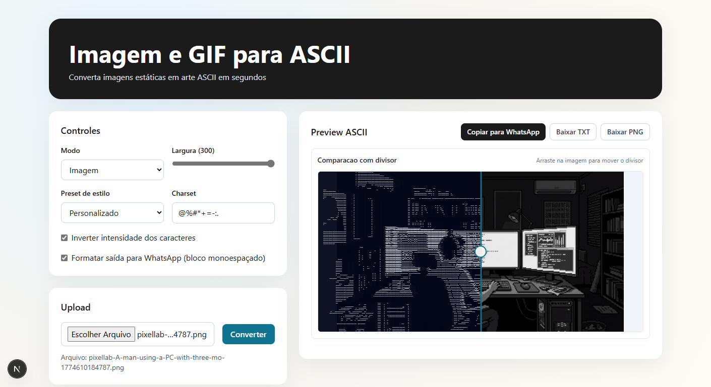

# AsciiMorph

Aplicacao web para converter imagens e GIFs em arte ASCII, com preview interativo e exportacao.

## Demo



## Funcionalidades

- Conversao de imagem estaticas (PNG, JPG, JPEG, WEBP) para ASCII.
- Conversao de GIF para ASCII frame a frame.
- Presets de estilo ASCII: Terminal, Bold, Minimal, Retro e WhatsApp.
- Comparacao visual no preview com divisor arrastavel direto na imagem.
- Download de saida em PNG ASCII (imagem) e GIF ASCII (animacao).
- Copia rapida do texto ASCII para area de transferencia.

## Stack

- Frontend: Next.js 15 + React 19 + TypeScript + Tailwind CSS
- Backend: FastAPI + Pillow

## Estrutura do projeto

```text
.
|-- backend/
|   |-- app/
|   |   |-- api/routes/convert.py
|   |   |-- core/config.py
|   |   |-- main.py
|   |   |-- schemas/
|   |   `-- services/
|   `-- requirements.txt
|-- frontend/
|   |-- app/
|   |-- components/
|   |-- lib/api.ts
|   `-- package.json
|-- demo.png
`-- README.md
```

## Requisitos

- Node.js 20+
- Python 3.11+

## Como rodar localmente

### 1. Backend (FastAPI)

```bash
cd backend
python -m venv .venv
. .venv/Scripts/activate
pip install -r requirements.txt
uvicorn app.main:app --reload
```

Backend em `http://localhost:8000`.

Health check: `GET http://localhost:8000/health`

### 2. Frontend (Next.js)

```bash
cd frontend
npm install
npm run dev
```

Frontend em `http://localhost:3000`.

## Variaveis de ambiente

### Frontend

- `NEXT_PUBLIC_API_URL`
  - Base da API consumida pelo frontend.
  - Padrao local: `http://localhost:8000/api/v1`

### Backend

Atualmente as configuracoes estao no `backend/app/core/config.py` com valores padrao:

- `app_name`: `AsciiMorph API`
- `app_version`: `0.1.0`
- `api_prefix`: `/api/v1`
- `frontend_origin`: `http://localhost:3000`

Se for publicar, ajuste o `frontend_origin` para o dominio real do frontend.

## Endpoints principais

### Conversao para texto ASCII

- `POST /api/v1/convert/image`
  - `file`: `image/png`, `image/jpeg`, `image/webp`
  - `width`: inteiro (20..300)
  - `charset`: string de caracteres para mapeamento
  - `invert`: `true/false`

- `POST /api/v1/convert/gif`
  - `file`: `image/gif`
  - `width`: inteiro (20..300)
  - `charset`: string de caracteres para mapeamento
  - `invert`: `true/false`

### Render para download de midia

- `POST /api/v1/convert/image/render`
  - Retorna: `image/png`

- `POST /api/v1/convert/gif/render`
  - Retorna: `image/gif`

## Deploy

Recomendacao para producao:

- Frontend na Vercel
- Backend em provedor dedicado para API Python (Render, Railway, Fly.io, etc.)

Motivo: conversao de imagem/GIF pode demandar mais tempo de processamento e limites de serverless podem impactar fluxos de arquivos maiores.

## Roadmap curto

- Melhorar observabilidade (logs estruturados e metricas de conversao).
- Adicionar limites e rate limiting por endpoint.
- Cobertura de testes automatizados no backend e frontend.

## Licenca

Defina aqui a licenca do projeto (ex.: MIT).
